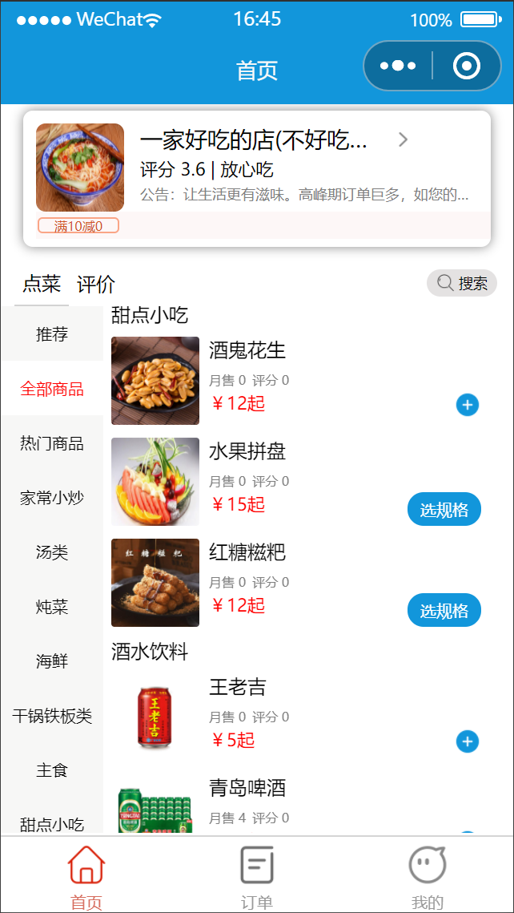
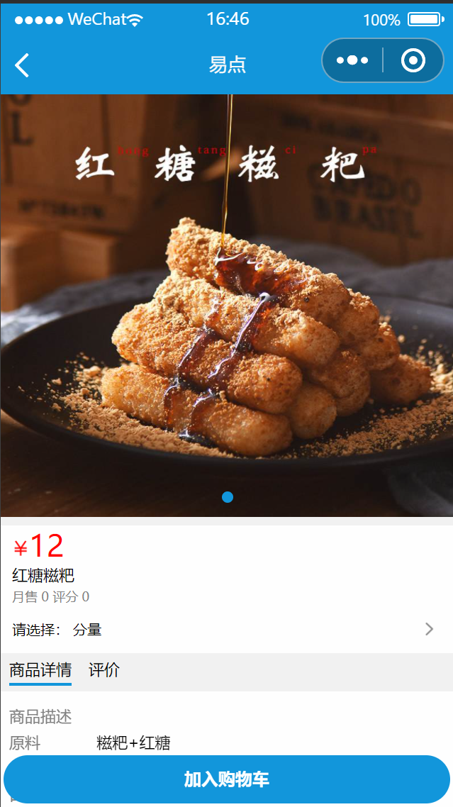
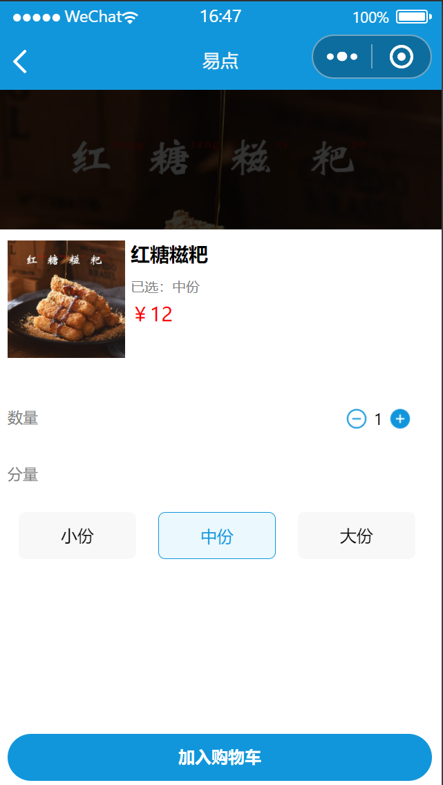
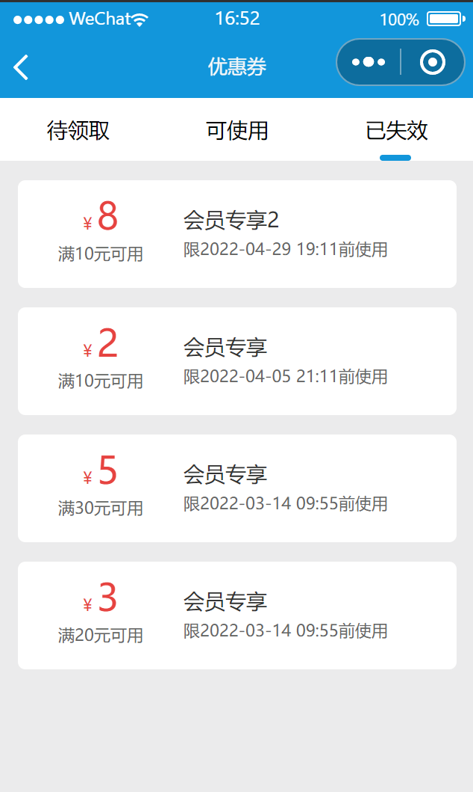
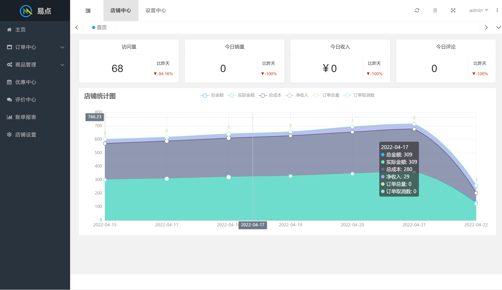
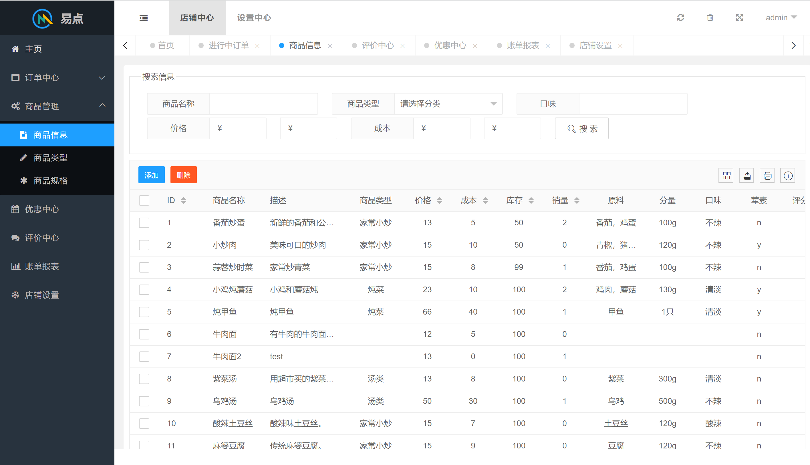
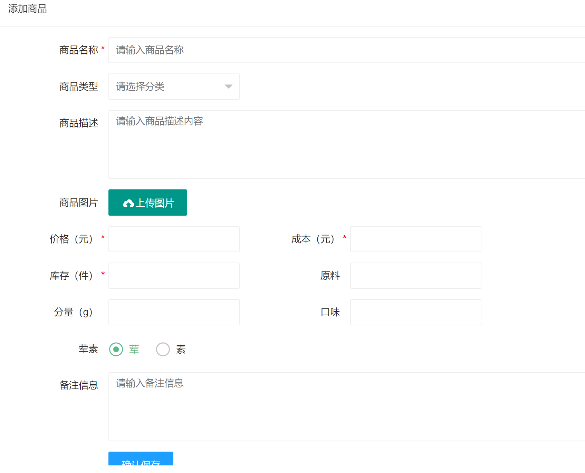

# EOrder

#### 1. 介绍
​		使用微信小程序开发的在线点餐平台。项目包括微信小程序、Web 商户端和 Java 服务端。功能上分为登录注册模块、商品模块、优惠模块、订单 模块、评论模块、搜索及热搜。  采用 B/S 架构、前后端分离模式进行设计与开发。前端使用微信小程序与 LayUI 开发，Java 服务端使用 SpringBoot、SpringMVC、Mybatis、MySQL、Redis 等技术。 

​		未登录用户（游客）可以使用小程序进行浏览、选择加入购物车、查看评论和查看优惠券等功能，进行下单 时提示用户登录。登录用户可以使用除游客以外的下单、领取使用优惠券和查看个人信息等功能。商户端需使用管理权限才能登录使用。 

本项目分为3部分，包括微信小程序、Web商户管理系统和Java服务器。

| 目录         | 说明         |
| ------------ | ------------ |
| Eorder       | Java项目代码 |
| eorder-admin | Web管理系统  |
| eorder-mini  | 微信小程序   |
| pic          | 图片         |

#### 2. 功能概览
系统总体功能下图所示。

#### 3. 系统环境

##### 3.1 环境

1. Java环境：JDK8、MySQL5.7、Maven、Redis、Docker。
2. 小程序环境：微信小程序。
3. Web端使用layUI开发。

##### 3.2 技术栈

Java技术栈：

1.  Spring Boot
2.  Spring MVC
3.  Mybatis/Mybatis Generator
4.  Mysql
5.  Redis
6.  Swagger
7.  Maven

#### 4. 使用说明

##### 4.0 使用前务必确认

1. MySQL是否导入（目录下的sql文件）
2. redis是否配置正确
3. **后台跨域是否配置正确（跨域配置：order-start > com.xxxx.config.WebMvcConfig）**
   - [什么是跨域？](https://www.yuque.com/u12141080/wnnf60/lsrvtn?singleDoc# 《跨域》)
4. 管理员账号
   - 92024109936，exR4HT7jzh7QPeRx

##### 4.1 Java端使用说明

1. MySQL数据库导入：建立db_school_eorder数据库将EOrder根目录下的db_school_eorder.sql文件导入。
2. redis数据库：修改yml文件的host和port正确即可。
3. 启动Application.java
4. 启动后，项目接口文档地址：http://localhost:8080/swagger-ui.html#/

##### 4.2 微信小程序使用说明

1. 导入项目至微信开发助手使用

##### 4.3 Web管理系统使用说明

1. 部署到Web服务器使用

#### 5. 项目展示

##### 5.1 微信小程序

###### **登录**

###### **主页**

###### **详情**

###### **加入购物车**

###### **订单详情**

###### **评论**

###### **优惠券**

###### **搜索**

##### 5.2 Web管理系统

###### **主页**

###### **系统列表实例**

###### **添加商品**

#### 6. 参与贡献

1.  Fork 本仓库
2.  新建 Feat_xxx 分支
3.  提交代码
4.  新建 Pull Request
